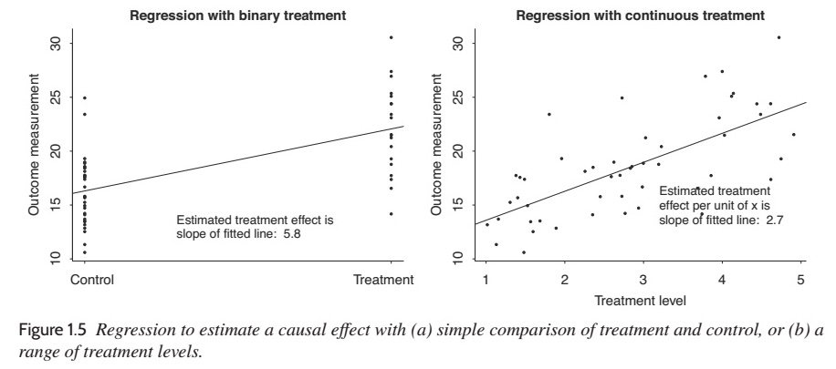
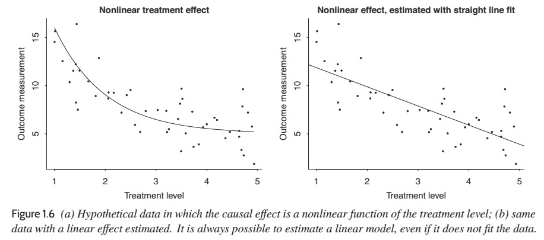

# The Three Challenges of Statistics

- Generalising from a sample to a population

- Generalising from a treatment to a control group

- *Generalising from observations to underlying concepts*

---

# Key Skills

- Understanding regression models

- Constructing regression models

- Fitting regression models to data

- Displaying and interpreting results

---

# What is Regression?

Regression is a technique for inferring **outcomes** (a.k.a. **dependent variables**) from a set a **predictors** (a.k.a. **covariates** or **independent variables**).

As musicologists, we can use it for many things!

- prediction

- exploring associations

- extrapolation

- *causal inference (yes, really!)*

---

# Typical (Music) Experiments

Key Question: Does 'treatment' *X* have an effect?

- one **treatment group**

- one **control group**

- **randomize** participants into treatment or control

This set-up is often called a one-way **ANOVA** (analysis of variance).

---

# Statistical Workflow

1. Look at your data.
  - *We'll start that next week!*
  
2. Choose a model.
  - *Always linear regression for us for now!*
  
3. Fit the model.
  - *It will takes us most of the course to get here!*
  
4. Understand the model fit.

5. Identify flaws and questionable assumptions.
  - *In the humanities, ‘outliers’ are often the most important story.*

---

# Classical vs. Bayesian Inferfence

- All statistical models are based on assumptions.
  - **All models are wrong; some models are useful.**
  
- Traditional statistics assumes that we know *nothing* about our model, e.g., that is would be just as likely for a conservatory musician to practice 0, 2, 8, or 24 hours per day.

- Bayesian statistics adds **prior** information, e.g., that we don't know for sure, but 4–8 hours of practice is most likely.

- Bayesian statistics used to be very difficult to do, but with modern software packages, it's very easy.

---

# What Does This Look Like?

---

# What Does This Look Like?

