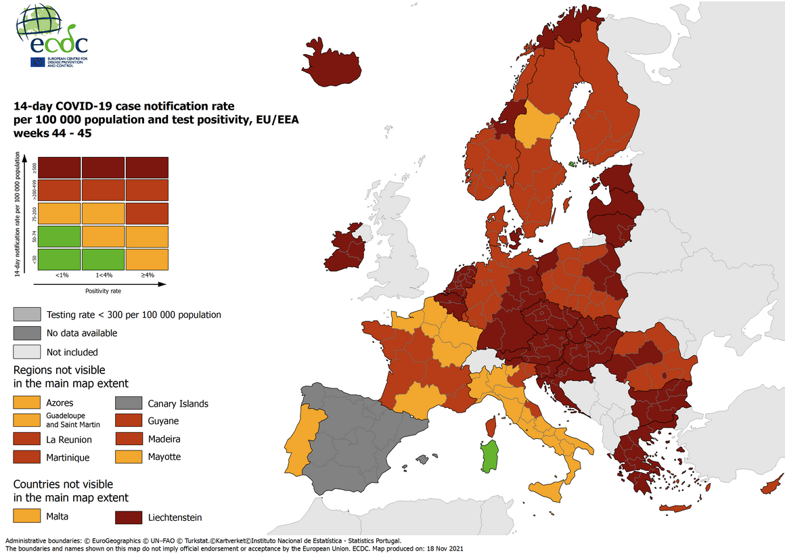
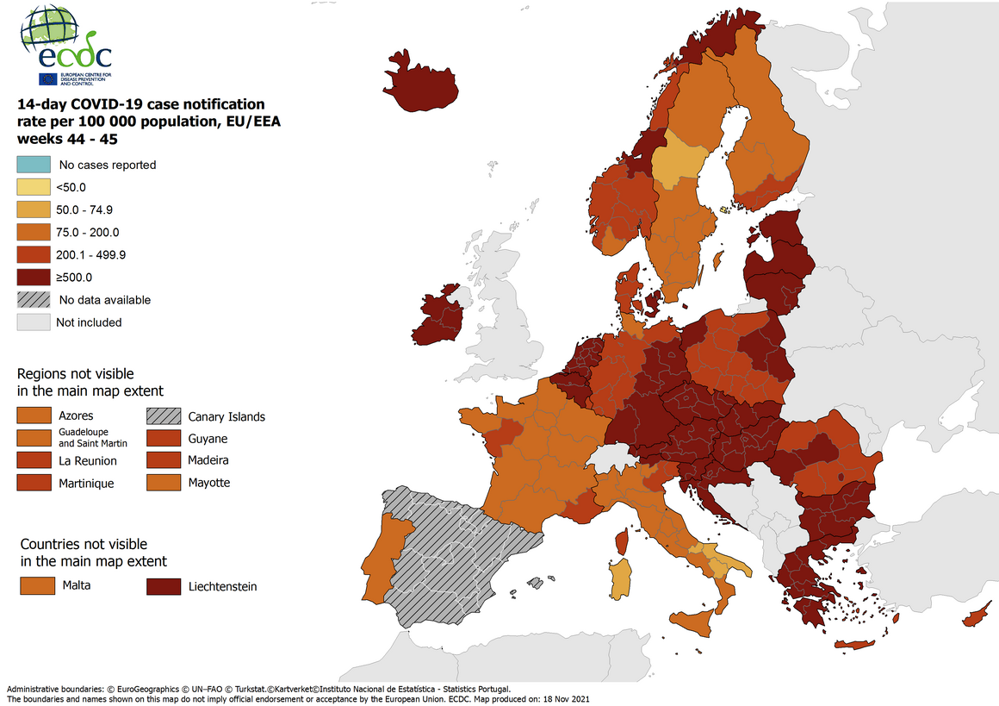
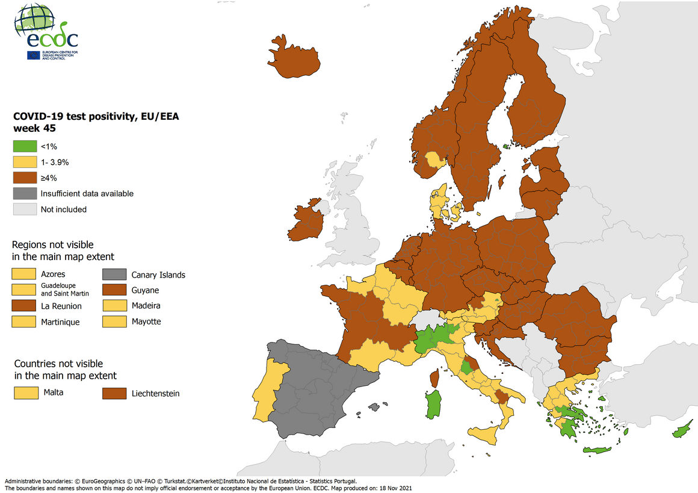
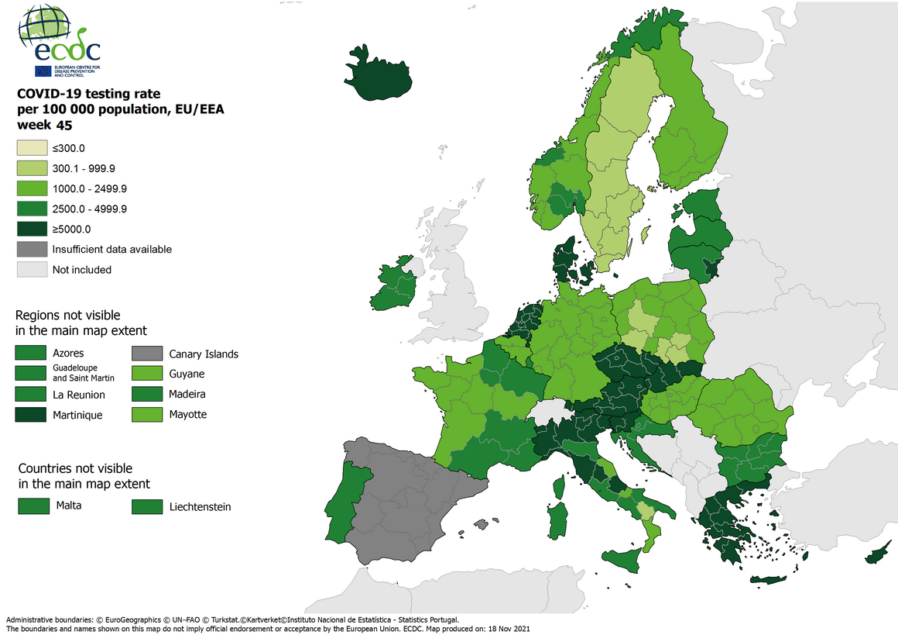

# Statistical Workflow

1. Look at your data.
  - *We're starting that this week!*
  
2. Choose a model.
  - *Always linear regression for us for now!*
  - *ANOVA studying treatment and control groups is especially common.*
  
3. Fit the model.
  - *It will takes us most of the course to get here!*
  
4. Understand the model fit.

5. Identify flaws and questionable assumptions.
  - *In the humanities, ‘outliers’ are often the most important story.*

---

# Data Collection and Visualisation

- Are you measuring what you think you're measuring?

- What is the difference between **validity** and **reliability**?

- How do you take a first look at your data?

---

# Real-World Measurement Can Be Messy!

---

# Real-World Measurement Can Be Messy!

---

# Real-World Measurement Can Be Messy!

---

# Real-World Measurement Can Be Messy!

---

# Real-World Measurement Can Be Messy!

---

# Validity vs. Reliability

An empirical study is **valid** if it is measuring what it claims to measure.
  - face validity
  - internal validity
  - external validity
  - ecological validity
  - many more!
  
An empirical study is **reliable** if it always returns (roughly) the same result under the same conditions.
  - *Not* measuring and simply recording the same observation value every time is rarely valid, but it is always reliable.

---
class: inverse, center, middle

# Discussion Point

### Gelman et al.: *A written test is not a valid measure of musical ability.*

---

# Exploratory Data Visualization

- Always look at your data before starting a statistical analysis.

- Your first visualizations do not need to look fancy!

- Start with two variables at a time.

- Ask yourself whether they are *continuous* or *discrete*.

---

# Basic Chart Types

- **Histogram**: One continuous variable
  - **Bar Chart**: Counts of one discrete variable
  
- **Scatterplot**: Two continuous variables

- **Boxplot**: One discrete variable and one continuous variable
