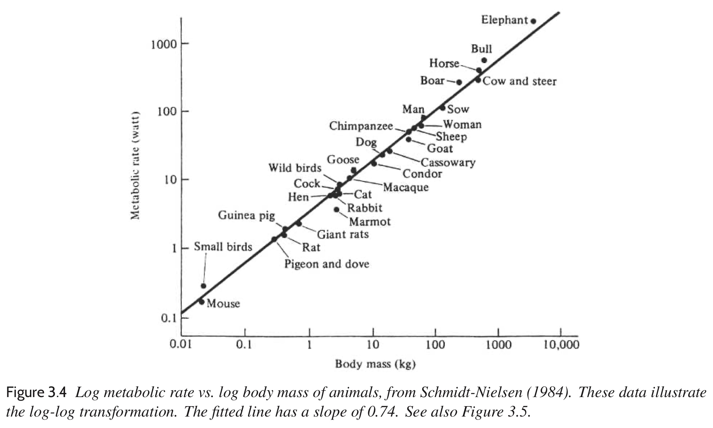
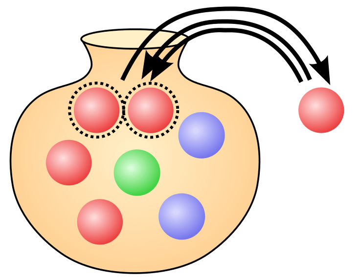
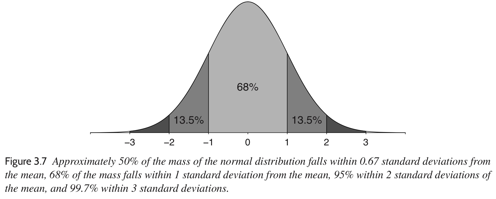

```{r, echo=FALSE}
paradiso <- readxl::read_excel("../Data/paradiso.xlsx")
```

# Review: The Three Challenges of Statistics

- Generalising from a sample to a population

- Generalising from a treatment to a control group

- *Generalising from observations to underlying concepts*

---

# Review: Validity and Reliability

- An empirical study is **valid** if it is measuring what it claims to measure.

  - This is *not* the same as generalisation.
  
  - A non-representative sample can limit the scope of conclusions even when the experimental design is valid.

- An empirical study is **reliable** if it always returns (roughly) the same result under the same conditions.

  - This is *not* the same as **reproducibility**, which is about providing sufficient details so that others can replicate your work.
  
  - Reproducibility is about being able to repeat the *process*, whereas reliability is about being able to obtain the same *result*.

---

# Review: Basic Data Visualisations

- **Histogram**: One continuous variable
  - **Bar Chart**: Counts of one discrete variable
  
- **Scatterplot**: Two continuous variables

- **Boxplot**: One discrete variable and one continuous variable

```{r, fig.width=24, fig.height=8}
boxplot(paradiso$optredens ~ paradiso$genre)
```

---
class: inverse, middle

# This Week: Lots of Math (and Not So Much R)

---

# Weighted Averages

Especially when we are dealing with corpus-based researcher, we often have groups of different sizes and need to use **weighted averages**. 

$$\text{weighted average} = \frac{\sum_j N_j \times x_j}{\sum_j N_j}$$
### Discussion Problem

- Suppose we are working with three manuscripts of plainchant from a monastery. 

- The first manuscript contains 123 chants, the second manuscript contains 40 chants, and the third manuscript contains 65 chants. 

- In the first manuscript, 40% of the chants are in the Dorian mode; in the second manuscript, 95%; and in the third, 31%.

- Across all three manuscripts, what percentage of the chants are in the Dorian mode?

---

# Vectors and Matrices

We do not really need vectors and matrices in this course, but it is good to remind yourself of them in case you see them in a paper.

$$\left(\begin{array}{cc} 1 & -1 \\ 1 & 0 \\ 1 & 3\end{array}\right) \times \left(\begin{array}{c}46.3 \\ 3.0\end{array}\right) = \left(\begin{array}{c}1 \times 46.3 - 1 \times 3.0 \\ 1 \times 46.3 + 0 \times 3.0 \\ 1 \times 46.3 + 3 \times 3.0\end{array}\right)$$
<br/>

Matrices are often written with capital letters and vectors are often written in boldface, and so you might see something like this in a paper.

$$\mathbf{y} = X \mathbf{β}$$
---

# Slopes and Intercepts

Linear regression is all about lines! :) Often, the best line will be described in **slope--intercept form**.

$$y = a + bx$$

The **intercept** is $a$, and it is usually difficult to interpret on its own.
  - More advanced statistical models often try to make the intercept more interpretable.
  
The **slope** is $b$, and it refers to how much our prediction changes for every unit increase in our predictor.
  - For example, suppose we are predicting the number of hours a conservatory student will practice their instrument each day based on how many hours they watch Netflix each day. If the slope from our linear regression comes out to –0.75, then we would predict that for every extra hour of Netflix watching, a conservatory student would practice 45 minutes less.
  
---

# Exponential Growth

Not every relationship is a straight line. One of the most common non-linear relationships is **exponential growth**. 

.pull-left[
We model exponential growth using **logarithms**...

$$ y = \mathrm{e}^x \Longleftrightarrow \log y = x $$

...and **log-linear models**.

$$\log y = a + bx$$
In a log-linear model, the slope parameter tells us that we should *multiply* our prediction $y$ by $\mathrm{e}^b$ for every unit increase in $x$.

We can log-transform $y$ in our data if we suspect exponential growth.
]

.right[
```{r echo=FALSE, fig.width = 5, fig.height = 5}
plot(x = 0:30, y = 2 * exp(0.3 * (0:30)), type = "l")
```
]

---

# Power-Law Growth

Another common non-linear relationship is **power-law growth**.

.pull-left[
We model power-law growth using *two* logarithms: both our predictor and our outcome.

$$\log y = a + b \log x$$
In a power-law model, the slope parameter tells us that we should multiply our prediction $y$ by $2^b$ if we double our predictor $x$.

We can log-transform *both* $y$ and $x$ in our data if we suspect power-law growth.
]

.right[
```{r echo=FALSE, fig.width = 5, fig.height = 5}
plot(x = 0:30, y = 2 * exp(0.3 * log(0:30)), type = "l")
```
]

---

# Log-Scale Axes

.center[]

---

# Error Terms

We use statistics because our models aren't perfect. Linear regression always includes an **error term**, usually denoted as $\epsilon$, which represents the difference between reality and out prediction.

$$y = a + bx + \epsilon$$

.pull-left[<br/> ]

.pull-right[
We say that the observations’ error terms have a **probability distribution**, which describes which outcomes are possible and how likely they are.

Often, we use the analogy of **Pólya's urn** to image proability distributions. Imagine an urn filled with balls with every possible outcome (e.g., how loud a Spotify track is) written on it.
]

???

Image source: enterprisegarage.io

---

# Characteristics of Probability Distributions

.pull-left[<br/><br/> ]

.pull-right[
The average of every outcome in the urn — let’s label them $z$  is called the **mean** or **expected value**, and is often denoted as either $\mu_z$ or $\mathrm{E}[z]$.

The average of the *squared distance* of each outcome from the mean is known as the **variance**: $\mathrm{E}[(z - \mu_z)^2]$, and is typically denoted as $\sigma_z^2$.
  - *Why do you think statisticians like to use *squared* distances?*
]

The square root of the variance is known as the **standard deviation** and is usually denoted at $\sigma_z$.
  - *Why do you think statisticians like to use the square root of variance?*

???

Image source: enterprisegarage.io

---

# The Normal Distribution

.center[]

If $z$ follows a normal distribution, we write $z \sim \mathcal{N}(\mu_z, \sigma_z^2)$.

**Linear transformations** of normal variables are also normal. 

$$z \sim \mathcal{N}(\mu_z, \sigma_z^2) \Longleftrightarrow a + bz \sim \mathcal{N}(\mu_z + a, b^2 \sigma_z^2)$$

**Sums** of normal variables are also normal. If $z_1$ and $z_2$ are uncorrelated,

$$z_1 + z_2 \sim \mathcal{N}(\mu_{z_1} + \mu_{z_2}, \sigma_{z_1}^2 + \sigma_{z_2}^2)$$

---

# Correlation

.pull-left[
If we have two random variables $u$ and $v$ and their means and standard deviations are $\mu_u$, $\mu_v$, $\sigma_u$, and $\sigma_v$, then their **correlation coefficient** $\rho_{uv}$ is:

$$\rho_{uv} = \mathrm{E}\left[\frac{(u - \mu_u) (v - \mu_v)}{\sigma_u \sigma_v}\right]$$
]

.pull-right[
```{r, echo = FALSE, fig.height = 3, fig.width = 5}
par(mar=c(2,2,1,2))
x <- rnorm(50, 2, 5)
y <- x + rnorm(50, 4, 2)
plot(x, y)
abline(4, 1)
```

]

The sum of *correlated* normal variables (i.e., $\rho_{{z_1}{z_2}} \neq 0$), is still normal with mean $z_1 + z_2$, but the formula for variance is a little more complicated.

$$z_1 + z_2 \sim \mathcal{N}(\mu_{z_1} + \mu_{z_2}, \sigma_{z_1}^2 + \sigma_{z_2}^2 + 2\rho\sigma_{z_1}\sigma_{z_2})$$

*You do not need to memorise these formulae.*

Later, we will learn how linear regression is just a way of measuring correlation.

---
class: center middle

# Other Distributions

## (Mostly FYI)

---

# Log-Normal Distribution

If $x$ is a random variable such that $\log x \sim \mathcal{N}(\mu_x, \sigma_x^2)$, then we say that $x$ has a **log-normal** distribution.

Log-normal distributions are useful when your outcome must be positive (e.g, the length of a concert).

.center[
```{r, echo = FALSE, fig.height = 5, fig.width = 8}
x <- seq(0, 5, 0.05)
y <- dlnorm(x)
plot(x, y, type = "l")
```
]

---

# Binomial Distribution

Binomial distributions are useful when you are counting the number of times something happens after a specific number of tries, e.g., the number of mistakes a student makes when singing back a 15-note dictation.

If the event will occur with probability $p$ and there are $n$ tries, then $\mu = np$ and $\sigma^2 = np(1-p)$. 

There is a special type of regression for binomial variables called **logistic regression**. We will not learn it in this course, however. If $p$ is close to 0.5, sometimes, a normal distributions is close enough.

.center[
```{r, echo = FALSE, fig.height = 4, fig.width = 8}
x <- 0:9
y <- dbinom(x, 15, 0.1)
barplot(y, names = x)
```
]

---

# Poisson Distribution

Poisson distributions are useful when you are counting the number of times something happens within a specific period of time, e.g., the number of notes of ‘The Flight of the Bumblebee’ that an instrumentalist can play within 30 seconds.

There is also a special type of regression for Poisson distributions, but simple linear regression assuming normal distributions is often close enough.

  - *Can you see why?*

.center[
```{r, echo = FALSE, fig.height = 4, fig.width = 8}
x <- 0:15
y <- dpois(x, 8)
barplot(y, names = x)
```
]

---

# Three Types of Errors

**Sampling error** is the error that arises when we have to work with a sample instead of our entire population.
  - In musicology, sometimes we have no sampling error! If your population is Beethoven symphonies or Beatles albums, for example, you can often use the entire population.
  
**Measurement error** is the error that arises because we can't measure our observations perfectly.
  - Measuring tuning is a good example: because of vibrato and timbre, it is difficult to meausre the *exact* pitch a musician is singing or playing.
  
**Model error** is the error that arises because our statistical models (e.g., linear regression) are only useful approximations of how the world really works.

All of these errors look the same to a computer or algorithm: you have to use your own judgement to know which kind of error is most important in any given study.

---

# Normal Errors and the Central Limit Theorem

Standard linear regression (and many other statistical techniques) assume that the total error is normally distributed:

$$\epsilon \sim \mathcal{N}(0, \sigma^2)$$

Normal errors are mathematically convenient, but they are also natural because of a property known as the **central limit theorem**.

### The distribution of the sum of a large number of independent random variables (e.g., errors) becomes closer and closer to a normal distribution as the number of variables increases.

Precisely because there are so many types of errors and because we expect different kinds of them to affect our models, there is a good chance that a normal distribution will be a good approximation for the combined error.

---
class: inverse

# Putting It All Together

Now we have everything we need to understand the core model of this course: linear regression with normal errors. For a set of observations $\{y_1, y_2, \ldots\}$ and corresponding predictors $\{x_1, x_2, \ldots\}$:

$$y_i = a + bx_i + \epsilon_i \qquad \epsilon_i \sim \mathcal{N}(0, \sigma^2)$$

The unobserved variables $a$, $b$, and $\sigma$ are known as **parameters**. 
  - More specifically, $a$ and $b$ are known as **coefficients**.
  - And $\sigma$ is known as a **scale parameter**, **variance parameter**, or **dispersion parameter**, depending on the author.
  
Usually only some of the parameters are scientifically interesting. For a particular study, we call these parameters the **quantities of interest** or sometimes **estimands**.
  - Very often, the primary quantity of interest is *b*.
  
When we ‘do statistics’ by fitting a model to data, we create **estimates** of the value of every parameter.

---

# Standard Errors and Confidence Intervals

Because of the errors, the parameter estimates we get from fitting a statistical model also have error. The standard deviation of that error is called the **standard error** of the parameter estimate.

We can use standard errors to generate **confidence intervals** for each parameter. We can choose the percentage of the time we want are confidence intervals to contain the true value of the parameter, but the higher the percentage, the wider the interval.

If the errors are normally or near-normally distributed:

  - Almost all possible parameter values will be within the estimate ± 3 SE.
  
  - The 99% confidence interval is the estimate ± 2½ SE.
  
  - The 95% confidence interval is the estimate ± 2 SE.
  
  - The 68% confidence interval is the estimate ± 1 SE.
  
  - The 50% confidence interval is the estimate ± ⅔ SE.

---

# Computing Standard Errors

### Population Mean

If you take a sample of *n* observations from a population and compute the mean $\mu$ and the standard deviation $\sigma$ of your sample...
  - ...then $\mu$ is an estimate of the true population mean with SE $\frac{\sigma}{\sqrt{n}}$.
  - If $n$ is small (< 20), then statisticians get more accurate standard errors using the ** *t* distribution** with $n - 1$ **degrees of freedom**.

### Proportions

If you take a sample of *n* observations from a binary (yes–no) process and count the number *y* of yes responses...
  - ...then $\frac{y}{n}$ is an estimate of the true proportion of yes with SE $\sqrt{\frac{\frac{y}{n}(1 - \frac{y}{n})}{n}}$.
  - If the true proportion is reasonably close to 0.5, then it can be simpler to approximate the standard error as $\frac{1}{2\sqrt{n}}$.
  
---

# Computing Standard Errors

### Differences Between Parameters

If you have two parameter estimates with standard errors and want to compute the standard error of the *difference* between them, the formula is

$$\text{standard error of the difference} = \sqrt{\text{se}_1^2 + \text{se}_2^2}$$
  - This arises often when comparing corpora or treatment and control groups.
  
  - *We'll try this later today using R and the Paradiso dataset.*
  
---

# Bias

We already know that if we choose a non-representative sample, the results may not generalise well to a larger population. Today, we can describe the problem more formally as **unmodelled error**.

The most important problem with generalisation is usually **bias**.

  - Bias means that our parameter estimates will by systematically too high or too low.
  
  - It is fundamentally a problem with the *data*, not the model.
  
  - If you know why you have bias, sometimes you can fix it by taking a weighted average of parameter estimates.
  
### Discussion Point

*If we tried to estimate the number of concerts UvA students attended before the pandemic, what kind of bias would you expect?*

---

# Null-Hypothesis Significance Testing

Traditional statistics emphasises a **null hypothesis**, typically that some parameter of interest is *exactly* zero.
  - In the humanities and social sciences, the null hypothesis is usually ridiculous: parameters may be very small, but they are unlikely to be *exactly* zero.
  
Traditional statistics computes the standard error and confidence interval for the parameter of interest and then check whether the confidence interval includes the null hypothesis (typically zero).

The ** *p* value ** is 1 – the confidence values of the narrowest confidence interval that contains the null hypothesis.
  - For example, if the narrowest confidence interval that contains the null hypothesis is the 95% confidence interval, then we say that $p = .05$.
  
The lower the *p* value, the less likely it would be to observe the data in your sample if the null hypothesis were true...
  - *...but we never really thought that the null hypothesis was true!*
  
---

# Epistemological Errors

Traditional statistics focusses on minimising two types of error.

  - A **Type I error** is when you claim that the null hypothesis is false when in fact the null hypothesis is true.
  
  - A **Type II error** is when you claim that the null hypothesis is true when in face the null hypothesis is false.
  
  - Traditional statistics focusses on Type I, but David Huron has argued that in the humanities, Type II  closes down potentially interesting research.
  
The textbook authors argue for a new approach to epistemological error.

  - A **Type S error** is when your parameter estimate has the wrong sign (e.g., watching Netflix *increases* musicians’ practice times instead of decreases).

  - A **Type M error** is when you claim a parameter estimate is larger than it actually is.
  
  - Focussing on Type I errors makes Type S and Type M errors more common due to the **statistical significance filter**.
  
---

# Problems with *p* Values

Traditional research in the social sciences insists on publishing only findings with *p* values less than some conventional vaue (**statistical significace**).
  - The most common significance requirement is $p < .05$.
  
### But...

- Statistical significance is not the same as **scientific significance**.

  - Collecting more data will *always* result in a lower *p* value, even though the underlying population has not changed.
  
- Non-significant is not the same as no effect.

  - High *p* values only mean that there is uncertainty. They don't prove or disprove anything.
  
- *And the difference between statistically significant and not statistically significant...is not statistically significant!*

---

# So What Should We Do?

<br/>

### Compute and report *p* values, because people expect them, but don't ignore non-significant results.

<br/>

### Try to show as many comparisons as you can and think of as many explanations as you can.

<br/>

### Make your data public whenever possible, so that your colleagues can try other models.
